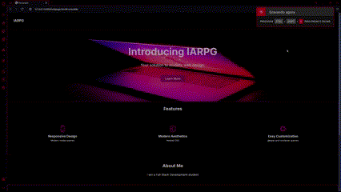
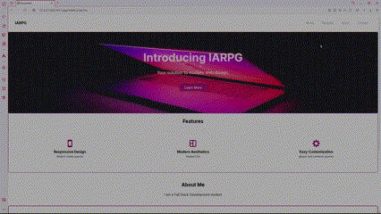

  <h2>Landing Page em HTML/CSS e TypeScript</h2>
  

    Desenvolvi uma Landing Page com ênfase na estética e na experiência visual, com o objetivo de aprimorar
    minhas habilidades em HTML e CSS. Este projeto foi de grande importância para o meu aprendizado e
    desenvolvimento técnico na área de design e Front-end.
  

<section align="center">
  

    <h3>Link da Página</h3>
    <h2>
      Link: <a href="https://igorarpgarcia.github.io/LandingPage/">Landing Page</a>
    </h2>
  

  

    <h3>
    Dark Theme
    </h3>
    
  

  

    <h3>
    Light Theme
    </h3>
    
  

</section>

